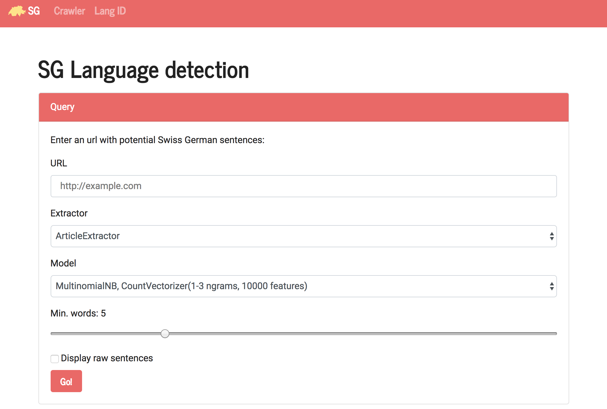
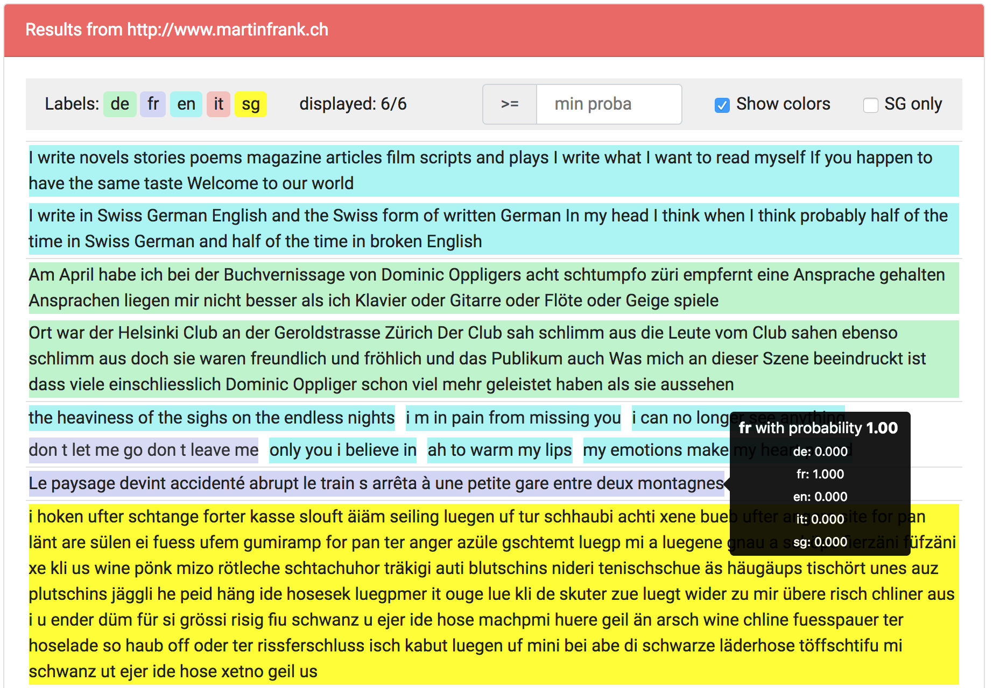

# SG-Detector

This repo contains a simple Python 3 Flask server for testing URL crawling / Swiss German extraction using different [boilerpipe extractors](https://github.com/derlin/boilerpipe3) and language identification models (see the `language-detection` root directory).

## Overview

You can choose between scraping an URL or entering text directly into a textfield. Using the scraping mode, you can switch between several [boilepipe extractor](https://code.google.com/archive/p/boilerpipe/) and also set the minimum numbers of words for the sentences.

For both modes, you can test several Machine Learning models for language identification. Supported languages are English, Italian, French, German and Swiss German.



Once you hit enter, the results are displayed as shown below. You can use a probability filter or decide to show only Swiss German. Finally, just hover a row for the probabilities to show up.



## Run locally

Using `virtualenv`, the procedure is quite straight-forward:

```bash
virtualenv -p python3 venv
source venv/bin/activate
pip install -r requirements.txt
python server.py
```

## Run inside Docker

This repo contains a _Dockerfile_ that you can use to create a docker image. 

__IMPORTANT__: before building the image, replace the `langid/naive_identifier.py` symlink by the real file:
```sh
cp  ../language-detection/langid/naive_identifier.py langid/naive_identifier.py
``` 

Then, build and run using:
```bash
# build the image langid-webapp
docker build -t langid-webapp --rm .
# launch a container in background,
# mapping the 8000 port to the local port 80
docker run -d -p 80:8000 langid-webapp
```
(_note_: the build process is quite long, since _numpy_ and _scipy_ are built from source on alpine. So feel free ot grab a coffee :) )

Open your browser: [http://localhost](http://localhost).

## Program arguments

The following arguments are available when launching `server.py`:

* `--help|-h`: display a help message.
* `--debug|-d`: run flask in debug mode.
* `--host|-h <ip>`: listen address.
* `--port|-p <port>`: listen port.